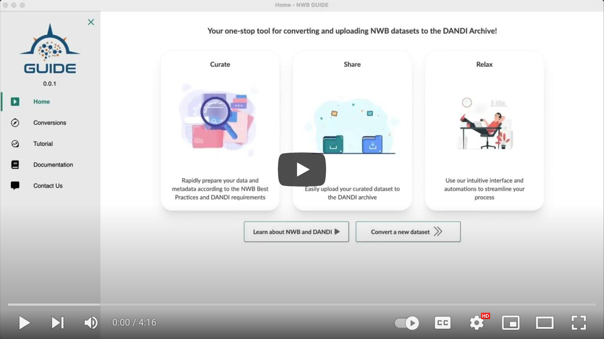

<p align="center">
  
  <h3 align="center">NWB Graphical User Interface for Data Entry</h3>
</p>

> **Note:** This project is under heavy pre-release development and is not recommended for practical use.

<!-- TABLE OF CONTENTS -->

## Table of Contents

- [About](#about)
- [Installation](#installation)
- [Getting Started](#getting-started)
- [Contributing](#contributing)

## About
NWB GUIDE is a desktop app that provides a no-code user interface for converting neurophysiology data to NWB.

<p align="center">
  <a href="https://www.youtube.com/watch?v=z-rk2wi5BDc" target="_blank">
  
  </a>
</p>


## Installation

Begin by downloading the latest release from the [GitHub release page](https://github.com/NeurodataWithoutBorders/nwb-guide/releases).

### Windows

Run the `setup.exe` file and follow all instructions.

> **Note:** If you run into any 'PermissionError' issues when performing operations in the NWB GUIDE on Windows, you may need to run the application using Admin mode.

### MacOS

Run the `.dmg` file and follow all instructions to move the file into your Applications folder.

### Ubuntu

#### Graphical Interface

Right-click the `.AppImage` file, navigate to `permissions`, and check any box which mentions 'run as executable'.

#### Ubuntu - CLI

From the terminal, simply type

```
chmod +x nwb-guide-X.Y.Z.AppImage
```

Where you are using version `X.Y.Z`; then execute by calling

```
./nwb-guide-X.Y.Z.AppImage
```

> **Note:** If you're running the `.AppImage` and the app window clears to a white screen within a few seconds of starting, you will need to follow the [Developer Instructions](#developer-installation) on the [linux-fix](https://github.com/neurodatawithoutborders/nwb-guide/tree/linux-fix) branch of the NWB GUIDE.


## Developer Installation

Start by cloning the repository

```
git clone https://github.com/catalystneuro/nwb-guide
```

Install the appropriate Python dependencies for your operating system.

### Windows
```bash
conda env create -f ./environments/environment-Windows.yml
```

### Mac
```bash
conda env create -f ./environments/environment-MAC.yml
```

### M1 Mac
```bash
conda env create -f ./environments/environment-MAC-arm64.yml
```

### Linux
```bash
conda env create -f ./environments/environment-Linux.yml
```

## Getting Started
Before starting NWB GUIDE, you'll need to ensure that the Python environment is activated.

```bash
conda activate nwb-guide
```

Next, install all JavaScript dependencies based on the `package-lock.json` file.

```bash
npm ci
```

You can now run the following command to start the application using Electron.

```bash
npm start
```

## Contributing

### Repo Structure
#### NWB GUIDE
1. `/src` - Contains all the source code for the frontend
    - `index.js` - The entry point for the application
    - `pages.js` - The main code that controls which pages are rendered and how they are linked together
    - `stories` - Contains all the Web Components and related Storybook stories
    - `electron` - Contains all the Electron-related code to enable conditional inclusion for development mode
    - `assets` - Contains all the frontend-facing assets (e.g. images, css, etc.)
2. `/pyflask` - Contains all the source code for the backend
