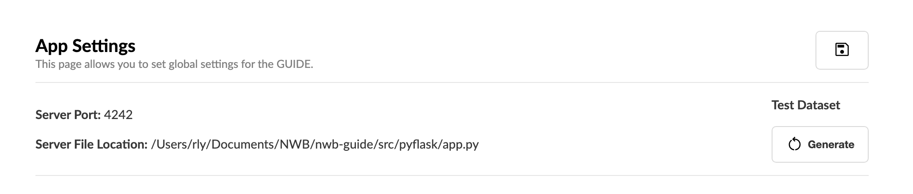

Dataset Generation
==================

Our tutorials focus on converting extracellular electrophysiology data in the SpikeGLX and Phy formats.
To get you started as quickly as possible, we’ve created a way to generate this Neuropixel-like dataset at the click of a button!

.. note::
  The **SpikeGLX** data format stores electrophysiology recordings.

  The **Phy** data format stores spike sorting results.

Navigate to the **Settings** page using button at the bottom of the main sidebar. Then press the **Generate** button in the top-right corner to initiate the dataset creation.

  Press the Generate button on the Settings page to create the dataset.

The generated data will populate in the ``~/NWB_GUIDE/test_data`` directory, where **~** is the home directory of your system. This includes a ``data`` folder with the original data as well as a ``dataset`` folder that duplicates this ``data`` across multiple subjects and sessions.

.. code-block:: bash

  test-data/
  ├── data/
  │   ├── spikeglx/
  │   │   ├── Session1_g0/
  │   │   │   ├── Session1_g0_imec0/
  │   │   │   │   ├── Session1_g0_t0.imec0.ap.bin
  │   │   │   │   ├── Session1_g0_t0.imec0.ap.meta
  │   │   │   │   ├── Session1_g0_t0.imec0.lf.bin
  │   │   │   │   └── Session1_g0_t0.imec0.lf.meta
  │   │   └── phy/
  ├── dataset/
  │   ├── mouse1/
  │   │   ├── mouse1_Session1/
  │   │   │   ├── mouse1_Session1_g0/
  │   │   │   │   ├── mouse1_Session1_g0_imec0/
  │   │   │   │   │   ├── mouse1_Session1_g0_t0.imec0.ap.bin
  │   │   │   │   │   ├── mouse1_Session1_g0_t0.imec0.ap.meta
  │   │   │   │   │   ├── mouse1_Session1_g0_t0.imec0.lf.bin
  │   │   │   │   │   └── mouse1_Session1_g0_t0.imec0.lf.meta
  │   │   │   │   └── mouse1_Session1_phy/
  │   │   │   └── mouse1_Session2/
  │   │   │       ├── mouse1_Session2_g0/
  │   │   │       │   ...
  │   │   │       └── mouse1_Session2_phy/
  │   │   │           ...
  │   ├── mouse2/
  │   │   ├── mouse2_Session1/
  │   │   │   ...
  │   │   └── mouse2_Session2/
  │   │       ...

Now you’re ready to start your first conversion using the NWB GUIDE!
