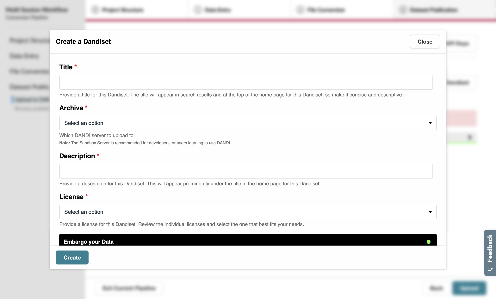
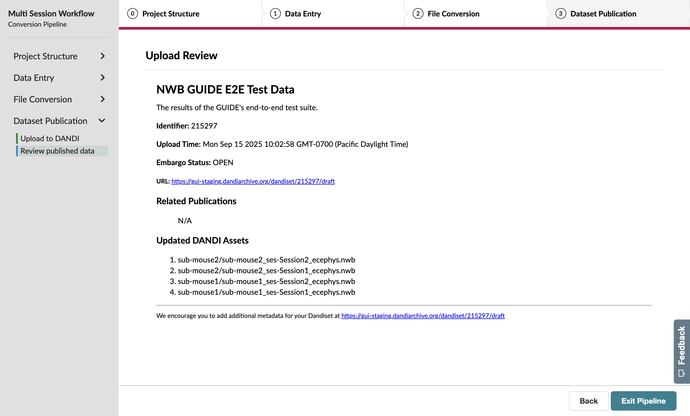

Dataset Publication
=======================================

For this tutorial, we'll be adapting the previous :doc:`Multi-Session Tutorial </tutorials/multiple_sessions>` to publish our data to the DANDI Archive.

.. note::
    This tutorial focuses on uploading to the Staging server.

    **When working with real data, you'll want to publish to the Main Archive**. In this case, follow the same steps outlined here—except replace the Staging server with the Main Archive.

.. note::
    Gaining access to DANDI requires approval from the archive administrators. Separate approval is required for both the main archive and the staging server.

    **This tutorial requires an account on the** :dandi-staging:`DANDI staging server <>`.

    We’re going to use the Staging server for this tutorial so we don’t crowd the main DANDI Archive with `synthetic` datasets! However, you’ll want to publish your `real` data on the main server—which will require a separate approval process.

    Once you receive notice that your account was approved, you can move on to the next steps.

Workflow Setup
--------------
1. Resume the conversion via the **Convert** page

2. Navigate to the **Workflow** page.

   a. Specify that you’d like to publish your data to the :dandi-archive:`DANDI Archive <>`.

3. Navigate back to the **Conversion Review** page

You'll now notice that the **Exit Pipeline** button has been replaced with **Next**, allowing you to move forward with publication on the DANDI Archive.

DANDI Upload
------------
You’ll need to specify your DANDI API keys if you haven’t uploaded from the GUIDE before. These keys are unique between the Main and Staging servers.

.. figure:: ../assets/tutorials/dandi/api-tokens.png
  :align: center
  :alt: A pop-up asking for DANDI API keys

To get your API key, visit the :dandi-staging:`staging website <>` and click on the profile icon in the top-right corner. This will show a dropdown with a copy button, which will assign your API key to the clipboard.

Provide this for the Staging API Key value on the GUIDE.

Press the **Submit** button to save your API key. This will populate the **Dandiset** input with a list of Dandisets associated with your account, which you can search by title or ID.

But what if you don't have any Dandisets to upload to? No problem!

Creating a Dandiset
^^^^^^^^^^^^^^^^^^^^^^^^^^^^^^^^^^
If you don't already have a Dandiset on the Staging server, you can create one directly from the GUIDE.

Press the **Create New Dandiset** button to open a pop-up that guides you through the required fields for Dandiset creation.

Once this pop-up form is submitted, the Dandiset input will now contain your new Dandiset.

.. figure:: ../assets/tutorials/dandi/dandiset-id.png
  :align: center
  :alt: DANDI upload page with Dandiset ID specified

Finally, press the **Upload** button to begin the upload process.

Final Review
------------
Once your upload to the DANDI Archive is complete, you will be able to review a quick overview of the associated Dandiset and a list of the uploaded files from this pipeline.

Congratulations on your first upload to the DANDI Archive from the GUIDE!
