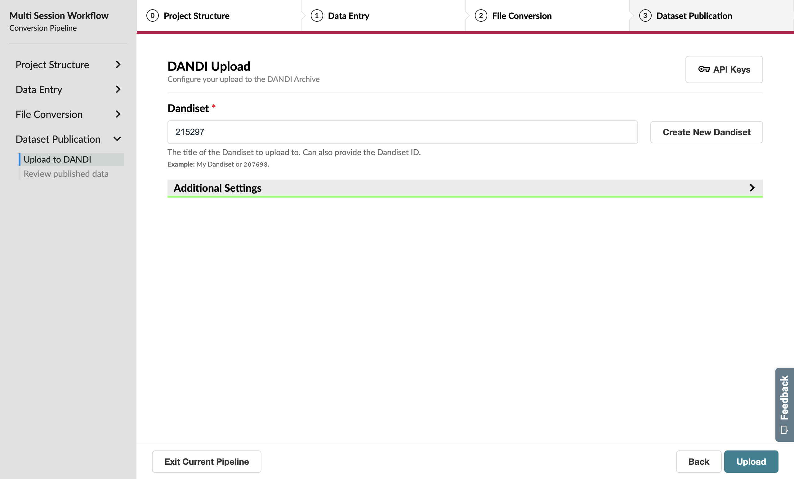

Dataset Publication
=======================================

For this tutorial, we'll be adapting the previous :ref:`Multi-Session Tutorial </tutorials/multiple_sessions>` to publish our data to the DANDI Archive.

Resume the conversion on the home page, then navigate back to the **Workflow** page.

Change your original selection to specify that you’d like to publish your data to the DANDI Archive.

.. note::
    Gaining access to the DANDI Archive can involve a long approval process. Make sure you’ve created an account on the :dandi-staging:`DANDI staging instance <>` before starting this section of the tutorial.

    We’re going use the Staging instance for this tutorial so we don’t crowd the DANDI Archive with tutorial outputs! However, you’ll likely want to publish real data on the main instance—which will require a separate approval process.

    Once you receive notice that your account was approved, you can move on to the next steps.

Navigate back to the **Conversion Review** page and ensure that you save the workflow change as you do.

You'll now notice that the **Exit Pipeline** button has been replaced with **Next**, allowing you to move forward with publication on the DANDI Archive.

DANDI Upload
------------
You’ll need to specify your DANDI API keys if you haven’t uploaded from the GUIDE before. These keys are unique between the Main and Staging instance.

To get your API key, visit the :dandi-staging:`staging website <>` and click on the profile icon in the top-right corner. This will show a dropdown with a copy button, which will assign your API key to the clipboard. Submit this to the Staging API Key input on the GUIDE.

.. figure:: ../assets/tutorials/dandi/api-tokens-added.png
  :align: center
  :alt: DANDI staging API key added

Once you have specified your Staging API Key, the **Dandiset** input will allow you to select any existing Dandiset associated with your account by ID (e.g. 207698) or name (e.g. NWB GUIDE Test).

Continue to the next page to trigger your upload to the DANDI Archive.

Creating a Dandiset from the GUIDE
^^^^^^^^^^^^^^^^^^^^^^^^^^^^^^^^^^
If you do not already own a Dandiset on staging, you will need to create one. Press the Create New Dandiset button to open a pop-up that guides you through the required fields for Dandiset creation—particularly Title, Archive (for our purposes, Development Server), Description, and License.

Once this pop-up form is submitted, the Dandiset input will now contain your new Dandiset.

Final Review
------------
Once your upload to the DANDI Archive is complete, you will be able to review a quick overview of the associated Dandiset and a list of the uploaded files from this pipeline.

Congratulations on your first upload to the DANDI Archive from the GUIDE!
