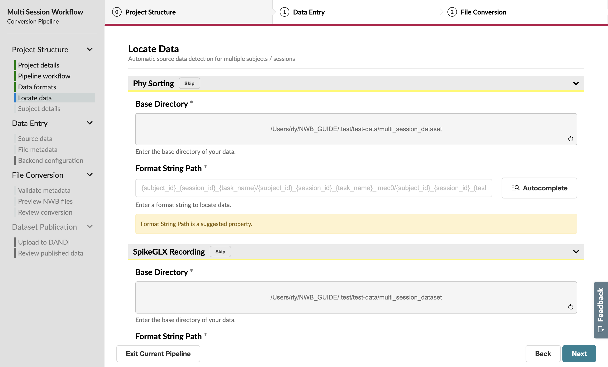

Managing Multiple Sessions
==========================

Now, let’s say that you’ve fallen behind and have a weeks worth of experiments to convert. This is where a multi-session workflow will come in handy.

Workflow Configuration
----------------------

On the Workflow page, confirm that this pipeline will be run on multiple sessions. After this, also select that you’d like to locate the source data programmatically.

Complete the first section of the GUIDE as normal until you reach a new **Locate Data** page after the Data Formats page.

Locate Data
-----------
This page helps you automatically identify source data for multiple subjects / sessions as long as your files are organized consistently.

File locations are specified as **format strings** that define source data paths of each selected data format. 

.. note::
    Format strings are one component of NeuroConv's **path expansion language**, which has some nifty features for manually specifying complex paths. Complete documentation of the path expansion feature of NeuroConv can be found **here**.

While you don’t have to specify a format strings for all of the pipeline’s data formats, we’re going to find all of our data here for this tutorial.

Format strings are specified using two components: the **base directory**, which is the directory to search in, and the **format string path**, where the source data is within that directory.

Given the structure of the tutorial dataset, we’ll select **~/NWB_GUIDE/test-data/dataset** as the base_directory.

We can take advantage of the **Autocomplete** feature of this page. Instead of manually filling out the format string, click the Autocomplete button and provide an example source data path (e.g. the mouse1_Session2_g0_t0.imec0.lf.bin file for SpikeGLX). Then, indicate the Subject  (mouse1) and Session ID (Session2) for this particular path. When you submit this form, you’ll notice that the Format String Path input has been auto-filled with a pattern for all the sessions.

Repeat this process for Phy, where mouse1_Session2_phy will be the example source data path.

.. figure:: ../assets/tutorials/multiple/pathexpansion-completed.png
  :align: center
  :alt: Blank path expansion page

Advance to the next page when you have entered the data locations for both formats.

Subject Metadata
----------------
On this page you’ll edit subject-level metadata across all related sessions. Unlike the previous few pages, you’ll notice that 
Sex and Species both have gray asterisks next to their name; this means they are **loose requirements**, which aren’t currently required 
but could later block progress if left unspecified.

.. figure:: ../assets/tutorials/multiple/subject-page.png
  :align: center
  :alt: Blank subject table

In this case, we have two subjects with two sessions each. Let’s say that each of their sessions happened close enough in time 
that they can be identified using the same **age** entry: P29W for mouse1 and P30W for mouse2.

Let’s also say that both of our subjects share some properties: both are male mice.

.. figure:: ../assets/tutorials/multiple/subject-complete.png
  :align: center
  :alt: Complete subject table

.. note::
    If you're trying to specify metadata that is shared across sessions, you can use the **Global Metadata** feature. 

    Pressing the Edit Global Metadata button at the top of the page will show a pop-up form which allows you to provide a
    single default value for each property, as long as it’s expected not to be unique.
    
    These values will take effect as soon as the pop-up form has been submitted.

    While Global Metadata is less relevant when we’re working with two subjeccts, this feature can be very powerful when you’re working with tens or even hundreds of subjects in one conversion.

    We recommend using Global Metadata to correct issues caught by the **NWB Inspector** that are seen across several sessions.

    You’ll be able to specify Global Metadata on the Source Data and File Metadata pages as well.

Now that we’ve specified all of the required and suggested metadata—which will be required later—we can move onto the next page.

Source Data Information
-----------------------
Because we used the Locate Data page to programmatically identify our source data, this page will largely be complete.

.. figure:: ../assets/tutorials/multiple/sourcedata-page.png
  :align: center
  :alt: Complete source data forms

Session Metadata
----------------
The file metadata page is a great opportunity to add rich annotations to the file, which will be read by anyone reusing your data in the future!

In conjunction with the subject information declared previously, all the required metadata to convert our dataset to NWB has already been specified—particularly because the Session Start Time has automatically been extracted from the SpikeGLX source data.

  A complete General Metadata form

.. figure:: ../assets/tutorials/multiple/metadata-subject-complete.png
  :align: center
  :alt: Complete Subject metadata form

  A complete Subject metadata form

When advancing to the next page, a progress bar will begin to show how many files are left to run a stub conversion on.

Continuing Forward
------------------
The rest of this workflow is identical to the single-session version, except that multiple sessions will be available to view on subsequent pages.
