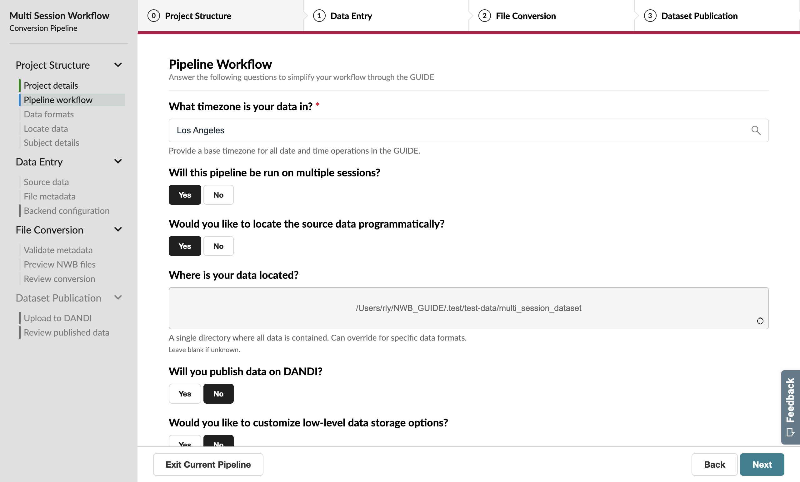
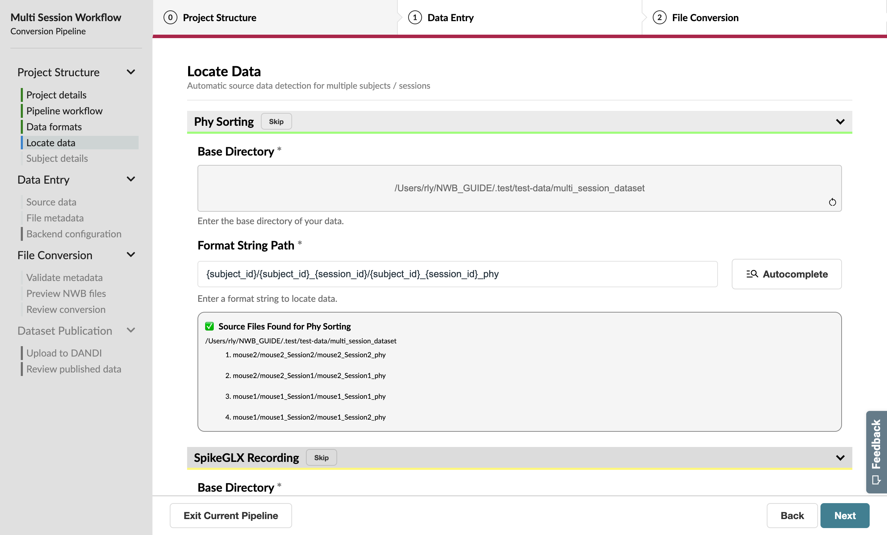

Managing Multiple Sessions
==========================

Now, let's imagine that you've already run multiple sessions of an experiment and now you want to convert them all to NWB at the same time. This is where a multi-session workflow will be useful.

Begin a new conversion on the **Convert** page and provide a name for your pipeline.

Workflow Configuration
----------------------

Update the Workflow page to indicate that you'll:

#. Run on multiple sessions
#. Locate the source data programmatically
#. Specify your dataset location ``~/NWB_GUIDE/test-data/multi_session_dataset``, where ``~`` is the home directory of your system.
#. Skip dataset publication.

Leave the rest of the settings as they are.

Data Formats
------------

As before, specify **SpikeGLX Recording** and **Phy Sorting** as the data formats for this conversion.

Locate Data
-----------

This page helps you automatically identify source data for multiple subjects / sessions as long as your files are organized consistently.

.. figure:: ../assets/tutorials/multiple/pathexpansion-page.png
  :align: center
  :alt: Blank path expansion page

File locations are specified as **format strings** that define source data paths of each selected data format.

.. note::
    Format strings are one component of NeuroConv's **path expansion language**, which has nifty features for manually specifying complex paths. Complete documentation of the path expansion feature can be found :path-expansion-guide:`here <>`.

While you don't have to specify format strings for all of the pipeline's data formats, we're going to find all of our data here for this tutorial. You'll always be able to confirm or manually select the final paths on the Source Data page later in the workflow.

Format strings are specified using two components: the **base directory**, which is the directory to search in, and the **format string path**, where the source data is within that directory.

The base directory has been pre-populated based on your selection on the Workflow page.

To avoid specifying the format string path by hand, click the **Autocomplete** button to open a pop-up form that will derive the format string from a single example path.

Provide a source data path for Phy by either dragging and dropping the folder ``multi_session_dataset/mouse1/mouse1_Session1/mouse1_Session1_phy`` into the **Example Folder** box or clicking the box and selecting a folder. Then enter the Subject ID (``mouse1``) and Session ID (``Session1``) for this particular path.

.. figure:: ../assets/tutorials/multiple/pathexpansion-autocomplete-filled.png
  :align: center
  :alt: Autocomplete modal completed

When you submit this form, you'll notice that the Format String Path input has been auto-filled with a pattern for all of the sessions, and a list of all of the source data found is shown in the gray box. Confirm that this list contains all four Phy folders.

Repeat this process for SpikeGLX, where ``multi_session_dataset/mouse1/mouse1_Session1/mouse1_Session1_g0/mouse1_Session1_g0_imec0/mouse1_Session1_g0_t0.imec0.ap.bin`` will be the example source data path.

.. figure:: ../assets/tutorials/multiple/pathexpansion-completed.png
  :align: center
  :alt: Completed path expansion information

Advance to the next page when you have entered the data locations for both formats.

Subject Metadata
----------------

On this page, you can edit subject-level metadata that is the same for all sessions. Unlike the previous few pages, you'll notice that
Sex and Species both have gray asterisks next to their name; this means they are **loose requirements**, which aren't currently required
but could later block progress if left unspecified.

.. figure:: ../assets/tutorials/multiple/subject-page.png
  :align: center
  :alt: Blank subject table

In this case, we have two subjects with two sessions each. Let's say that each of their sessions happened close enough in time that they can be identified using the same **age** entry: ``P29W`` for ``mouse1`` and ``P30W`` for ``mouse2``.

We should also indicate the ``sex`` of each subject since this is a requirement for `uploading to the DANDI Archive <https://www.dandiarchive.org/handbook/135_validation/#missing-dandi-metadata>`_.

.. figure:: ../assets/tutorials/multiple/subject-complete.png
  :align: center
  :alt: Complete subject table

Advance to the next page when you have entered subject metadata for all subjects.

Source Data Information
-----------------------

Because we used the Locate Data page to programmatically identify our source data, this page should mostly be complete. Verify that the identified paths appear as expected for each session by clicking the "Phy Sorting" header to expand the section for Phy data and examining the "Folder Path" value. Do the same for the SpikeGLX data.

One notable difference between this and the single-session workflow is that the next few pages will allow you to toggle between sessions using the **session manager** sidebar on the left. Try this out. Under "Sessions", click "sub-mouse2" and "ses-Session1" to locate the source data for a different session from this subject.

Session Metadata
----------------

Aside from the session manager, the file metadata page in the multi-session workflow is nearly identical to the single-session version.

.. figure:: ../assets/tutorials/multiple/metadata-nwbfile.png
  :align: center
  :alt: Complete General Metadata form

  A complete General Metadata form

The information supplied on the Subject Metadata page has been used to fill in the Subject metadata for each session.

.. figure:: ../assets/tutorials/multiple/metadata-subject-complete.png
  :align: center
  :alt: Complete Subject metadata form

  A complete Subject metadata form

You'll notice that there's an **Edit Default Metadata** button at the top of the page. This feature allows you to specify a single default value for each property that is expected to be the same across all sessions. **Use this button to fill in general metadata for your sessions**, such as the Institution, which will save you time and effort while ensuring your files still follow Best Practices.

Finish the rest of the workflow as you would for a single session by completing a full conversion after you review the preview files with the NWB Inspector and Neurosift.

Congratulations on completing your first multi-session conversion! You can now convert multiple sessions at once, saving you time and effort.
