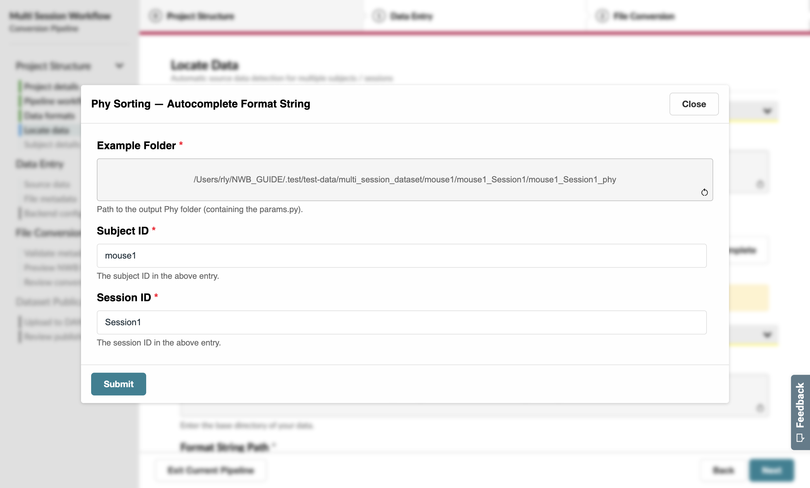
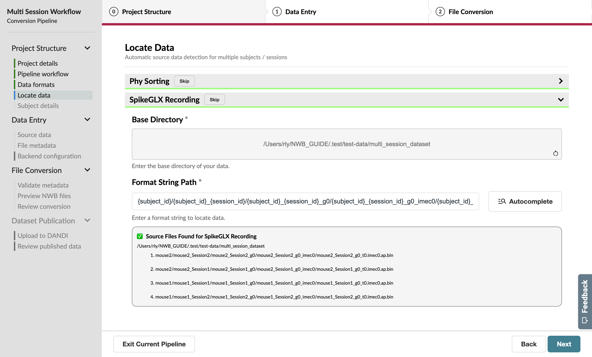
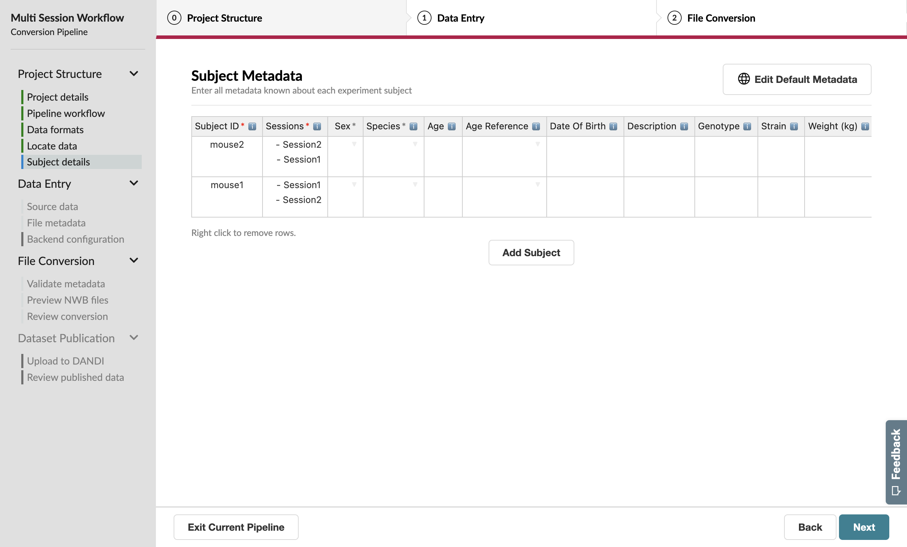
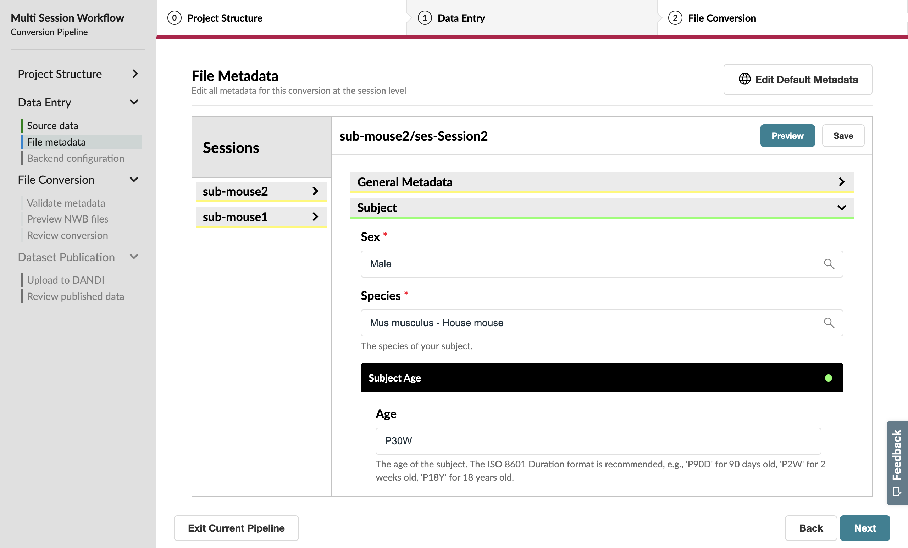

Managing Multiple Sessions
==========================

Now, let’s say that you’ve already run some of your experiments and now you want to convert them all at the same time. This is where a multi-session workflow will come in handy.

Workflow Configuration
----------------------

On the Workflow page, confirm that this pipeline will be run on multiple sessions. After this, also select that you’d like to locate the source data programmatically and skip dataset publication.

.. figure:: ../assets/tutorials/multiple/workflow-page.png
  :align: center
  :alt: Workflow page with multiple sessions and locate data selected

Complete the first section of the GUIDE as normal until you reach a new **Locate Data** page after the Data Formats page.

Locate Data
-----------
This page helps you automatically identify source data for multiple subjects / sessions as long as your files are organized consistently.

.. figure:: ../assets/tutorials/multiple/pathexpansion-page.png
  :align: center
  :alt: Blank path expansion page

File locations are specified as **format strings** that define source data paths of each selected data format.

.. note::
    Format strings are one component of NeuroConv's **path expansion language**, which has some nifty features for manually specifying complex paths. Complete documentation of the path expansion feature of NeuroConv can be found :path-expansion-guide:`here <>` .

While you don’t have to specify format strings for all of the pipeline’s data formats, we’re going to find all of our data here for this tutorial. You'll always be able to confirm or manually select the final paths on the Source Data page later in the workflow.

Format strings are specified using two components: the **base directory**, which is the directory to search in, and the **format string path**, where the source data is within that directory.

Given the structure of the tutorial dataset, we’ll select **~/NWB_GUIDE/test-data/dataset** as the **base directory**, where **~** is the home directory of your system.

We can take advantage of the **Autocomplete** feature of this page. Instead of manually filling out the format string, click the **Autocomplete** button to open a pop-up form that will derive the format string from a single example path.

.. figure:: ../assets/tutorials/multiple/pathexpansion-autocomplete-open.png
  :align: center
  :alt: Autocomplete modal on path expansion page

Provide an example source data path (for example, the ``mouse1_Session1_g0_t0.imec0.lf.bin`` file for SpikeGLX), followed by the Subject (``mouse1``) and Session ID (``Session1``) for this particular path. 

When you submit this form, you’ll notice that the Format String Path input has been auto-filled with a pattern for all the sessions.

.. figure:: ../assets/tutorials/multiple/pathexpansion-autocomplete-submitted.png
  :align: center
  :alt: Path expansion page with autocompleted format string

Repeat this process for Phy, where ``mouse1_Session2_phy`` will be the example source data path.

Advance to the next page when you have entered the data locations for both formats.

Subject Metadata
----------------
On this page you’ll edit subject-level metadata across all related sessions. Unlike the previous few pages, you’ll notice that
Sex and Species both have gray asterisks next to their name; this means they are **loose requirements**, which aren’t currently required
but could later block progress if left unspecified.

In this case, we have two subjects with two sessions each. Let’s say that each of their sessions happened close enough in time that they can be identified using the same **age** entry: ``P29W`` for ``mouse1`` and ``P30W`` for ``mouse2``.

We should also indicate the ``sex`` of each subject since this is a requirement for `uploading to the DANDI Archive <https://www.dandiarchive.org/handbook/135_validation/#missing-dandi-metadata>`_.

.. note::
    If you're trying to specify metadata that is shared across sessions, you can use the **Global Metadata** feature.

    Pressing the Edit Global Metadata button at the top of the page will show a pop-up form which allows you to provide a
    single default value for each property, as long as it’s expected not to be unique.

    These values will take effect as soon as the pop-up form has been submitted.

    While Global Metadata is less relevant when we’re working with two subjeccts, this feature can be very powerful when you’re working with tens or even hundreds of subjects in one conversion.

    We recommend using Global Metadata to correct issues caught by the **NWB Inspector** that are seen across several sessions.

    You’ll be able to specify Global Metadata on the Source Data and File Metadata pages as well.

Source Data Information
-----------------------
Because we used the Locate Data page to programmatically identify our source data, this page should mostly be complete. You can use this opportunity to verify that the identified paths appear as expected for each session.

.. figure:: ../assets/tutorials/multiple/sourcedata-page.png
  :align: center
  :alt: Complete source data forms

One notable difference between this and the single-session workflow, however, is that the next few pages will allow you to toggle between sessions using the **session manager** sidebar on the left.

Session Metadata
----------------
Aside from the session manager and global metadata features noted above, the file metadata page in the multi-session workflow is nearly identical to the single-session version.

.. figure:: ../assets/tutorials/multiple/metadata-nwbfile.png
  :align: center
  :alt: Complete General Metadata form

  A complete General Metadata form

Acting as global metadata, the information supplied on the subject metadata page has pre-filled the Subject metadata for each session.

  A complete Subject metadata form

Finish the rest of the workflow as you would for a single session by completing a full conversion after you review the preview files with the NWB Inspector and Neurosift.

Congratulations on completing your first multi-session conversion! You can now convert multiple sessions at once, saving you time and effort.
