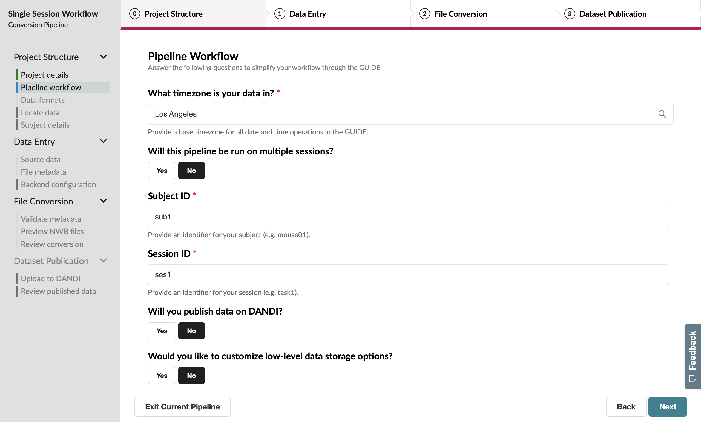
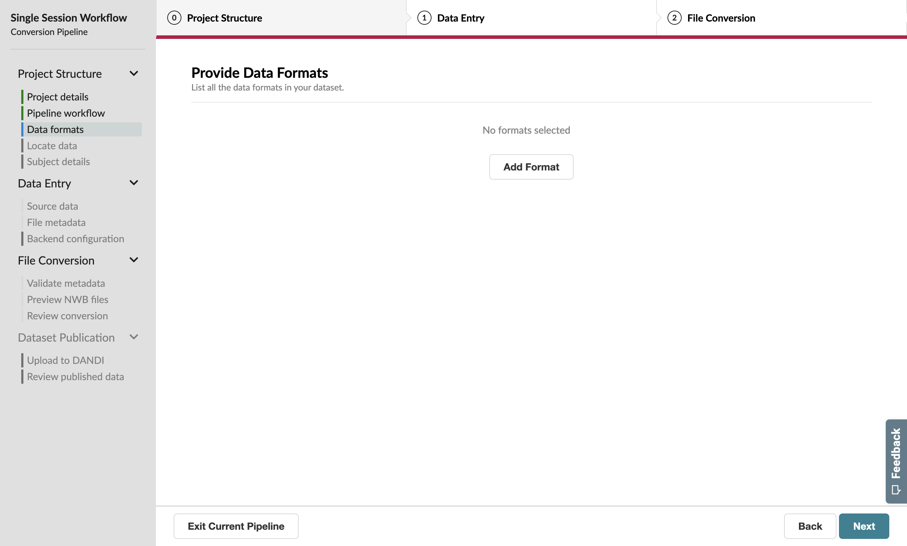
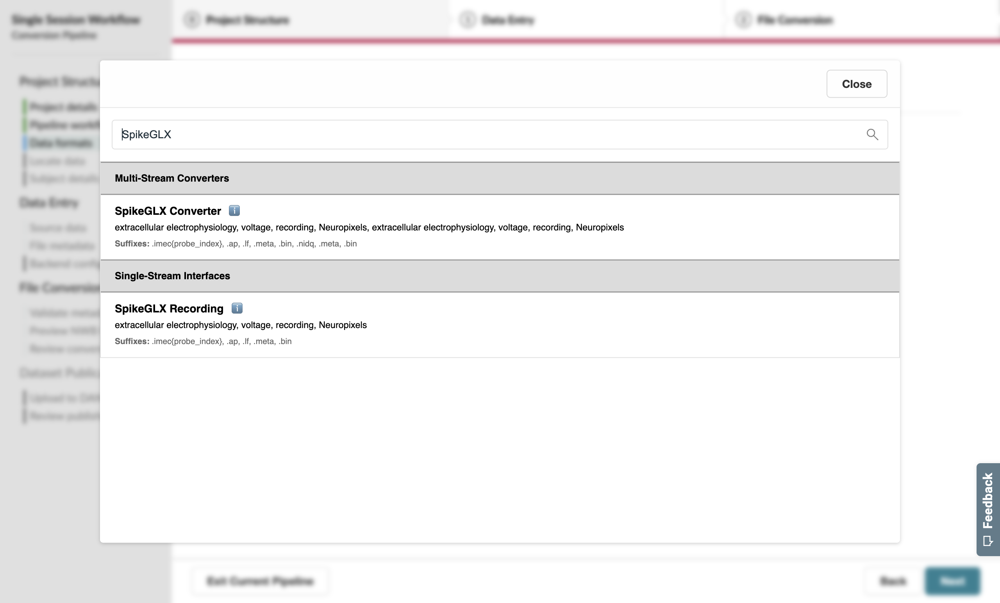
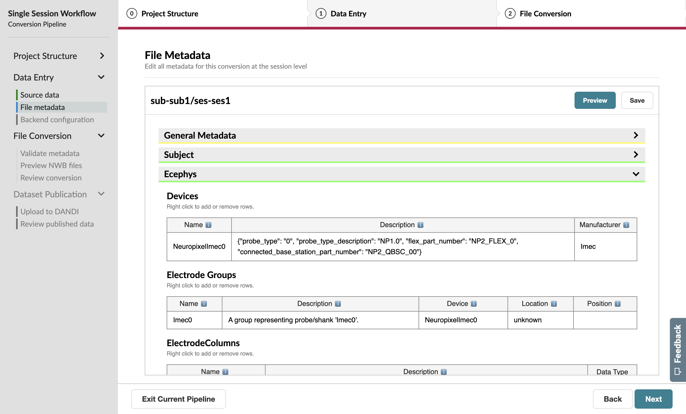

Converting a Single Session
===========================

Let's imagine you've just completed an experimental session and you'd like to convert your data to NWB right away.

Upon launching the GUIDE, you'll begin on the **Convert** page. If you're opening the application for the first time, there should be no pipelines listed on this page.

Press the **Create a new conversion pipeline** button to start the conversion process.

Project Structure
-----------------

Project Setup
^^^^^^^^^^^^^

To begin, set the **name** for this tutorial pipeline to "Single Session Workflow". The red asterisk next to the "Name" field indicates that this is a required field.

You can also set the **output location** for your NWB files, but for this tutorial, leave it as the default location.

.. figure:: ../assets/tutorials/single/valid-name.png
  :align: center
  :alt: Project Setup page with valid name

Press "Next" to continue.

Pipeline Workflow
^^^^^^^^^^^^^^^^^

On this page, you'll specify the type of **workflow** you'd like to follow for this conversion pipeline.

First, you can set the time zone for the data. If the data was collected in a different time zone than your local time zone, you can search for and select that time zone. For this tutorial, leave it as the default time zone.

For the next question "Will this pipeline be run on multiple sessions?", keep the "No" button selected.

For a single-session workflow, you'll need to specify a **Subject ID** and **Session ID** to identify the data you'll be converting. Enter "sub1" for the Subject ID and "ses1" for the Session ID.

For this tutorial, turn off the option to publish the data to the DANDI Archive. This will be covered in a later tutorial.

For the last question "Would you like to customize low-level data storage options?", keep the "No" button selected.

Press "Next" to continue.

Data Formats
^^^^^^^^^^^^

Next, you'll specify the data formats you're working with. The GUIDE supports 40+ neurophysiology formats. A full registry of available formats is available :doc:`here </format_support>`.

This tutorial uses the SpikeGLX format, a common output for Neuropixels recordings, and the Phy format, a common output of spike sorting and curation. To specify that your pipeline will handle these files, press the “Add Format” button.

.. figure:: ../assets/tutorials/single/format-options.png
  :align: center
  :alt: Format pop-up on the Data Formats page

Then, select the relevant formats—in this case, **SpikeGLX Recording** (not SpikeGLX Converter) and **Phy Sorting**—from the pop-up list. Use the search bar to filter for the format you need.

The selected formats will then display above the button.

Press "Next" after you have selected **SpikeGLX Recording** and **Phy Sorting**.

.. figure:: ../assets/tutorials/single/all-interfaces-added.png
  :align: center
  :alt: Data Formats page with both SpikeGLX Recording and Phy Sorting added to the list

Data Entry
-----------

Source Data Information
^^^^^^^^^^^^^^^^^^^^^^^

On this page, specify the **phy** folder and **.ap.bin** (SpikeGLX) file so that the GUIDE can find this source data to complete the conversion.

As discussed in the :doc:`Dataset Generation </tutorials/dataset>` tutorial, these can be found in the ``~/NWB_GUIDE/test-data/single_session_data`` directory, where ``~`` is the home directory of your system. If you just generated the dataset, this folder may still be open in your file navigator.

Click the **Phy Sorting** header to expand the section. Under "Folder Path", you can either drag-and-drop the **phy** folder into the box from your file navigator or click the box to navigate to and select the **phy** folder.

.. figure:: ../assets/tutorials/single/sourcedata-page-specified.png
  :align: center
  :alt: Source Data page with source locations specified

Next, click the **SpikeGLX Recording** header to expand the section. Under "File Path", you can either click the box to navigate to the **.ap.bin** file or drag-and-drop the **.ap.bin** file into the box from your file navigator. The **.ap.bin** file is located in the ``~/NWB_GUIDE/test-data/single_session_data/spikeglx/Session1_g0/Session1_g0_imec0`` folder.

Press "Next" to extract metadata from these source data files and folders.

Session Metadata
^^^^^^^^^^^^^^^^

The file metadata page is a great opportunity to add rich annotations to the NWB file, which will be read by anyone reusing your data in the future!

Click the **General Metadata** header to expand the section.

The Session Start Time is already specified because this field was automatically extracted from the SpikeGLX source data.

.. figure:: ../assets/tutorials/single/metadata-nwbfile.png
  :align: center
  :alt: Metadata page with invalid Subject information

The **General Metadata** header is underlined yellow because all required fields have been set, but some recommended fields are missing values, such as **Institution** and **Experiment Description**. These fields are not required, but they can be useful for future users of the data.

Take a minute to fill out some of these fields, such as the fields in the **Institutional Info** box and the **Experimenter** field.

The **Subject** header is underlined red, indicating that required fields are missing values. Click the **Subject** header to expand the section. The subject's **sex**, **species**, and **age** are missing. Select "Male" for **sex**, "Mus musculus - House mouse" for **species**, and "P25W", which represents 25 weeks old, for **age**.

.. figure:: ../assets/tutorials/single/metadata-subject-complete.png
  :align: center
  :alt: Metadata page with valid **Subject** information

  The status of the Subject information will update in real-time as you fill out the form.

Click the **Ecephys** header to expand the section. Ecephys is short-hand for "extracellular electrophysiology". This section contains metadata about the probes and electrodes used. For the test SpikeGLX data, these metadata have been extracted from the SpikeGLX source data. You do not need to modify it in this tutorial.

Press "Next" to trigger the conversion of a small part of your source data into a preview NWB file.

File Conversion
---------------

Inspector Report
^^^^^^^^^^^^^^^^

This page shows the output of the NWB Inspector tool, which validated your preview NWB file against the latest NWB Best Practices. Red boxes represent errors, and yellow boxes represent best practice warnings that could be ignored.

When you are satisfied with the Inspector Report, press "Next".

Conversion Preview
^^^^^^^^^^^^^^^^^^

This page uses the Neurosift tool to allow you to explore the structure of your NWB file so that you can ensure the packaged data matches your expectations.

In particular, take a look at the lefthand metadata table and check that the information you provided on the previous pages is present in the NWB file.

Expand the yellow "acquisition" section and select "ElectricalSeriesAP" to view a plot of the test SpikeGLX data.

.. figure:: ../assets/tutorials/single/preview-page.png
  :align: center
  :alt: Neurosift preview visualization

Neurosift can be useful for many other exploration tasks—but this will not be covered in this tutorial.

The NWB file shown here is just a preview NWB file that was created using only a small part of the source data. Press "Run Conversion" to trigger the full conversion of your data to the NWB format. This conversion that may take some time depending on the dataset size.

Conversion Review
^^^^^^^^^^^^^^^^^

Congratulations on finishing your first conversion of neurophysiology data to NWB using the NWB GUIDE! Click the file name ``sub-sub1_ses-ses1.nwb`` to view the location of the NWB file in your file navigator.

If you had other data to add to the NWB file that are in formats not supported by NWB GUIDE, you can use PyNWB (Python) or MatNWB (MATLAB) to open the NWB file and add the data programmatically. See the documentation links at the bottom of the "Conversion Review" page for tutorials and more information.

.. figure:: ../assets/tutorials/single/conversion-results-page.png
  :align: center
  :alt: Conversion results page with a list of converted files

This was a straightforward workflow with only a single session... But what if you have multiple sessions to convert?
