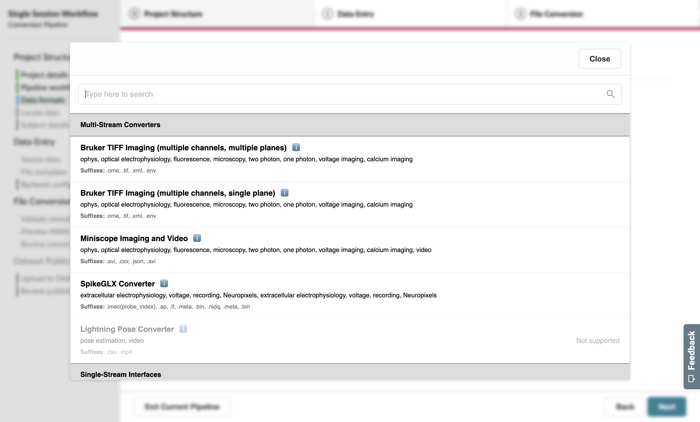
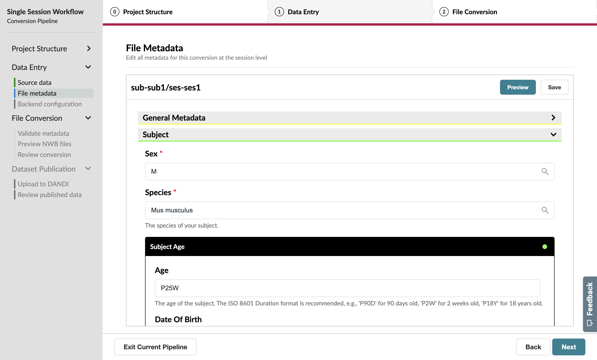
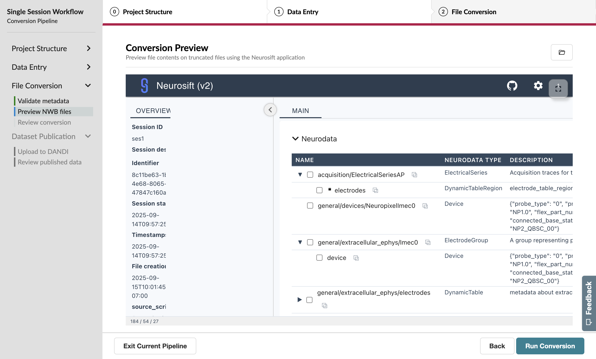
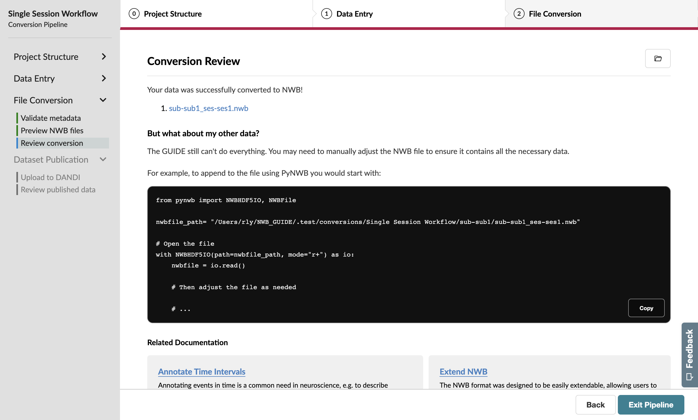

Converting a Single Session
===========================

As a researcher, you’ve just completed an experimental session and you’d like to convert your data to NWB right away.

Upon launching the GUIDE, you'll begin on the Conversions page. If you’re opening the application for the first time, there should be no pipelines listed on this page.

.. figure:: ../assets/tutorials/home-page.png
  :align: center
  :alt: Home page

Press the **Create a new conversion pipeline** button to start the conversion process.

Project Structure
-----------------

Project Setup
^^^^^^^^^^^^^

The Project Setup page will have you define two pieces of information about your pipeline: the **name** and, optionally, the **output location** for your NWB files.

.. note::
   Choosing a good output location is important for two reasons, namely **conversion speed** and **disk space**.

   1. SSDs will be much faster than HDDs. We’d recommend moving the output location to an SSD if available.
   2. If you don’t have much disk space available on your main drive, we recommend changing the output location to a drive that has ample space.

You’ll notice that the name property has a red asterisk next to it, which identifies it as a required property.

.. figure:: ../assets/tutorials/single/info-page.png
  :align: center
  :alt: Project Setup page with no name (invalid)

After specifying a unique project name, the colored background and error message will disappear, allowing you to advance to the next page.

Workflow Configuration
^^^^^^^^^^^^^^^^^^^^^^
On this page, you’ll specify the type of **workflow** you’d like to follow for this conversion pipeline.

Since this is a single-session workflow, you’ll need to specify a **Subject ID** and **Session ID** to identify the data you’ll be converting.

.. figure:: ../assets/tutorials/single/workflow-page.png
  :align: center
  :alt: Workflow page

Additionally, we’ll turn off the option to upload to the DANDI Archive and approach this in a later tutorial.

Data Formats
^^^^^^^^^^^^
Next, you’ll specify the data formats you’re working with on the Data Formats page. The GUIDE supports 40+ total neurophysiology formats. A full registry of available formats is available here.

.. figure:: ../assets/tutorials/single/formats-page.png
  :align: center
  :alt: Date Formats page

The tutorial we're working with uses the SpikeGLX and Phy formats, a common output for NeuroPixel recordings and subsequent spike sorting. To specify that your pipeline will handle these files, you’ll press the “Add Format” button.

Then, select the relevant formats—in this case, **SpikeGLX Recording** and **Phy Sorting**—from the pop-up list. Use the search bar to filter for the format you need.

.. figure:: ../assets/tutorials/single/search-behavior.png
  :align: center
  :alt: Searching for SpikeGLX in the format pop-up

The selected formats will then display above the button.

.. figure:: ../assets/tutorials/single/interface-added.png
  :align: center
  :alt: Data Formats page with SpikeGLX Recording added to the list

Advance to the next page when you have **SpikeGLX Recording** and **Phy Sorting** selected.

Data Entry
-----------

Source Data Information
^^^^^^^^^^^^^^^^^^^^^^^
On this page, specify the relevant **.bin** (Spikeglx) file and **phy** folder so that the GUIDE can find this source data to complete the conversion.

Session Metadata
^^^^^^^^^^^^^^^^
The file metadata page is a great opportunity to add rich annotations to the file, which will be read by anyone reusing your data in the future!

The General Metadata for the GUIDE has already been specified because the Session Start Time was automatically extracted from the SpikeGLX source data.

However, we still need to add the Subject information—as noted by the red accents around that item. Let’s say that our subject is a male mouse with an age of P30D.

  The status of the Subject information will update in real-time as you fill out the form.

This dataset will also have **Ecephys** metadata extracted from the SpikeGLX source data.

.. figure:: ../assets/tutorials/single/metadata-ecephys.png
  :align: center
  :alt: Ecephys metadata extracted from the SpikeGLX source data

Let's leave this as-is and advance to the next page.

As you advance, you’ll trigger a stub conversion and be shown a progress bar that indicates how many files are left.

File Conversion
---------------

Inspector Report
^^^^^^^^^^^^^^^^

The Inspector Report page allows you to validate the generated stub NWB files against the latest Best Practices and determine whether you’ve provided all the metadata for your files. Using the internal sidebar, you can scope the displayed errors by a particular subject or session.

.. figure:: ../assets/tutorials/single/inspect-page.png
  :align: center
  :alt: NWB Inspector report

As before, yellow boxes indicate suggestions that are encouraged but not required.

Conversion Preview
^^^^^^^^^^^^^^^^^^
On the Conversion Preview, Neurosift allows you to explore the structure of the NWB file and ensure your data matches your expectations.

Advancing from this page will trigger the full conversion of your data to the NWB format, a process that may take some time depending on the dataset size.

Conversion Review
^^^^^^^^^^^^^^^^^

Congratulations on finishing your first conversion of neurophysiology files using the NWB GUIDE!

This was a pretty simple workflow. But what if you have multiple sessions to convert?
